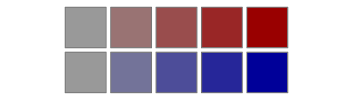
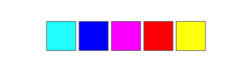

# Simple colour manipulation in R 😎

The `shades` package allows colours to be manipulated easily in R. Properties such as brightness and saturation can be quickly queried, changed or varied, and perceptually uniform colour gradients can be constructed. It plays nicely with the pipe operator from the [popular `magrittr` package](https://github.com/smbache/magrittr), and fit naturally into that paradigm.

The package is available on [CRAN](https://cran.r-project.org/package=shades), but it is still quite early in its development, so you may prefer to obtain an up-to-date version from GitHub using [`devtools`](https://github.com/hadley/devtools):


```r
# install.packages("devtools")
devtools::install_github("jonclayden/shades")
```

Feedback on the package or suggestions are welcome, either by filing an issue or by email.

## Usage

Colours are represented in R using [CSS-style hex strings](https://en.wikipedia.org/wiki/Web_colors), but there is also a dictionary of predefined named colours such as `"red"` and `"blue"`. Either of these may be passed to most graphics functions, but creating variations on a particular colour can be awkward.

The `shades` package defines a simple class, `shade`, which uses exactly this same convention and is entirely compatible with built-in colours, but it also stores information about the coordinates of the colours in a particular [colour space](https://en.wikipedia.org/wiki/Color_space).


```r
library(shades)
red <- shade("red")
print(unclass(red))
## [1] "red"
## attr(,"space")
## [1] "sRGB"
## attr(,"coords")
##      R G B
## [1,] 1 0 0
```

From here, the package switches between colour spaces as required, allowing various kinds of colour manipulation to be performed straightforwardly. For example, let's find the saturation level of a few built-in colours.


```r
saturation(c("papayawhip","lavenderblush","olivedrab"))
## [1] 0.1647100 0.0588200 0.7535287
```

Now let's consider a colour gradient stepping through two different colour spaces, which we might want to use as a palette or colour scale.


```r
swatch(gradient(c("red","blue"), 5))
```


```r
swatch(gradient(c("red","blue"), 5, space="Lab"))
```


Here, we are using the `swatch` function to visualise a set of colours as a series of squares. Notice the more uniform appearance of the gradient when it traverses through the [Lab colour space](https://en.wikipedia.org/wiki/Lab_color_space).

Similarly, we can create a set of new colours by changing the brightness and saturation levels of some base colours, and make the code more readable by using the [`magrittr` pipe operator](https://github.com/smbache/magrittr).


```r
library(magrittr)
c("red","blue") %>% brightness(0.6) %>% saturation(seq(0,1,0.25)) %>% swatch
```



This operation takes the original two colours, reduces their brightness to 60%, assigns a whole series of saturation levels to the result, and then passes it to `swatch` for visualisation. The colours could just as easily be passed to a graphical function to be used as a colour scale.

The package also supports colour mixing, either additively (as with light) or subtractively (as with paint). For example, consider additive mixtures of the three primary RGB colours.


```r
cols <- shade(c("red", "red", "green", "green", "blue"))
cols[2] <- cols[2] %>% addmix("green")
cols[4] <- cols[4] %>% addmix("blue")
swatch(cols)
```


Similarly, we can subtractively combine the three secondary colours.


```r
cols <- shade(c("cyan", "cyan", "magenta", "magenta", "yellow"))
cols[2] <- cols[2] %>% submix("magenta")
cols[4] <- cols[4] %>% submix("yellow")
swatch(cols)
```



A "light mixture" infix operator, `%.)%`, and a "paint mixture" infix operator, `%_/%`, are also available.


```r
("red" %.)% "green") == "yellow"
## [1] TRUE
("cyan" %_/% "magenta") == "blue"
## [1] TRUE
```

Finally, you can calculate perceptual distances to a reference colour, as in


```r
distance(c("red","green","blue"), "red")
## [1]  0.00000 86.52385 53.07649
```
