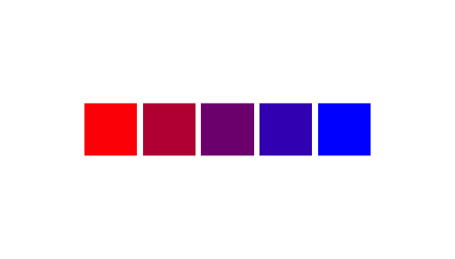
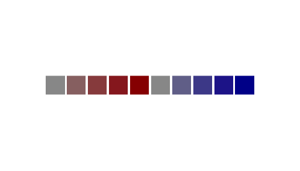

# Simple colour manipulation in R 😎

The `shades` package allows colours to be manipulated easily in R. It allows properties of colours such as brightness and saturation to be easily changed or varied, and perceptually uniform colour gradients to be constructed. It plays nicely with the pipe operator from the [popular `magrittr` package](https://github.com/smbache/magrittr), and fit naturally into that paradigm.

The package is still under developments and is not yet on [CRAN](http://cran.r-project.org), but it can be installed easily using [`devtools`](https://github.com/hadley/devtools):

```R
# install.packages("devtools")
devtools::install_github("jonclayden/shades")
```

Feedback or suggestions are welcome.

## Usage

Colours are represented in R using [CSS-style hex strings](https://en.wikipedia.org/wiki/Web_colors), but there is also a dictionary of predefined named colours such as `"red"` and `"blue"`. Either of these may be passed to most graphics functions, but creating variations on a particular colour can be awkward.

The `shades` package defines a simple class, `shade`, which uses exactly this same convention and is entirely compatible with built-in colours, but it also stores information about the coordinates of the colours in a particular [colour space](https://en.wikipedia.org/wiki/Color_space).

```R
red <- shade("red")
print(unclass(red))
## [1] "red"
## attr(,"space")
## [1] "sRGB"
## attr(,"coords")
##      R G B
## [1,] 1 0 0
```

From here, the package switches between colour spaces as required, allowing various kinds of colour manipulation to be performed straightforwardly. For example, let's find the saturation level of a few built-in colours.

```R
saturation(c("papayawhip","lavenderblush","olivedrab"))
## [1] 0.16470588 0.05882353 0.75352113
```

Now let's consider a colour gradient stepping through two different colour spaces, which we might want to use as a palette or colour scale.

```R
swatch(gradient(c("red","blue"), 5))
```



```R
swatch(gradient(c("red","blue"), 5, space="LAB"))
```


Here, we are using the `swatch` function to visualise a set of colours as a series of squares. Notice the more uniform appearance of the gradient when it traverses through the [Lab colour space](https://en.wikipedia.org/wiki/Lab_color_space).

Similarly, we can create a set of new colours by changing the brightness and saturation levels of some base colours, and make the code more readable by using the [`magrittr` pipe operator](https://github.com/smbache/magrittr).

```R
c("red","blue") %>% brightness(0.6) %>% saturation(seq(0,1,0.25)) %>% swatch
```



This operation takes the original two colours, reduces their brightness to 60%, assigns a whole series of saturation levels to the result, and then passes it to `swatch` for visualisation. The colours could just as easily be passed to a graphical function to be used as a colour scale.
